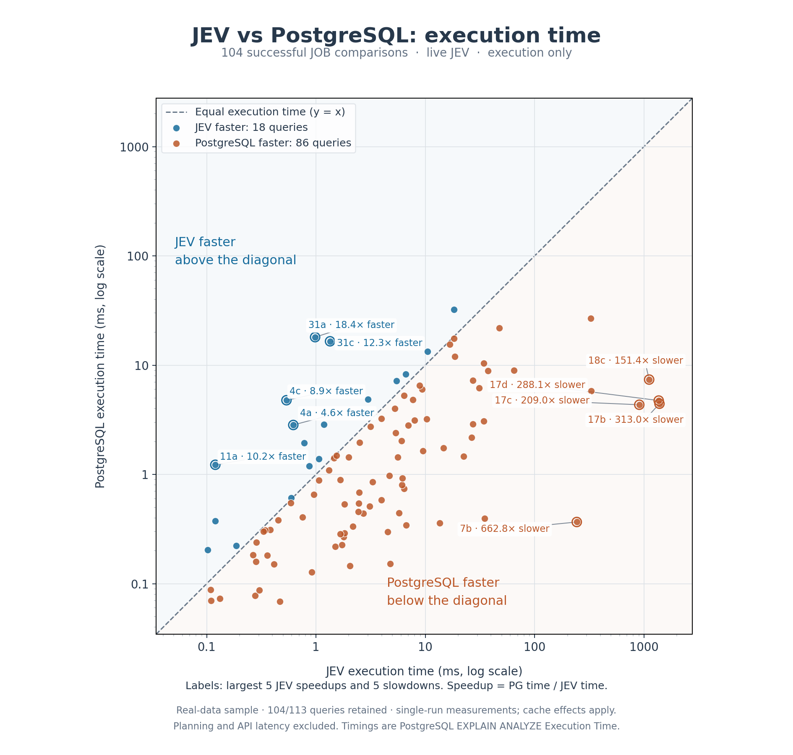

# pg_jevplanner

A PostgreSQL extension to let [Jev](https://typesafe.ai/blog/introducing-system-one-models-and-jev) choose the join ordering.



## Quickstart

`TYPESAFE_API_KEY` is required in the server process env.

```sql
CREATE EXTENSION pg_jevplanner;
SET max_parallel_workers_per_gather = 0;
SET jev.enabled = on;
SET jev.log_http = on; -- logging jev payload
EXPLAIN SELECT a.id FROM a JOIN b ON a.id=b.id JOIN c ON b.id=c.id;
```

## Architecture

At `make_join_rel()`, provide state and candidates to Jev.

- `state.query_sql`: the overall query, including upper operations such as GROUP BY, ORDER BY and LIMIT.
- `state.query_block`: search ID, nesting level and relation IDs for the active block.
- `state.relations`: block-local IDs, unique aliases, original aliases, table/schema names where applicable, native row estimates, widths and filters.
- `state.join_predicates`: predicates with referenced relation IDs, including equalities moved into PostgreSQL equivalence classes.
- `state.current_components`: the current forest, row estimates and already-selected logical subtrees.
- `state.step`, objective, tuple fraction and estimated limit.
- `questions.select_join`: `type: "choice"`, instructions and `criteria`. Each `p0`, `p1`, … criterion is a JSON string describing the pair, estimated output and native physical summary. Response selection is `answers.select_join.choice`.

## Acknowledgment

Inspired by [_Training a 4B model to produce 81% faster query plans than Postgres_](https://rohanbansal.com/qorl).
